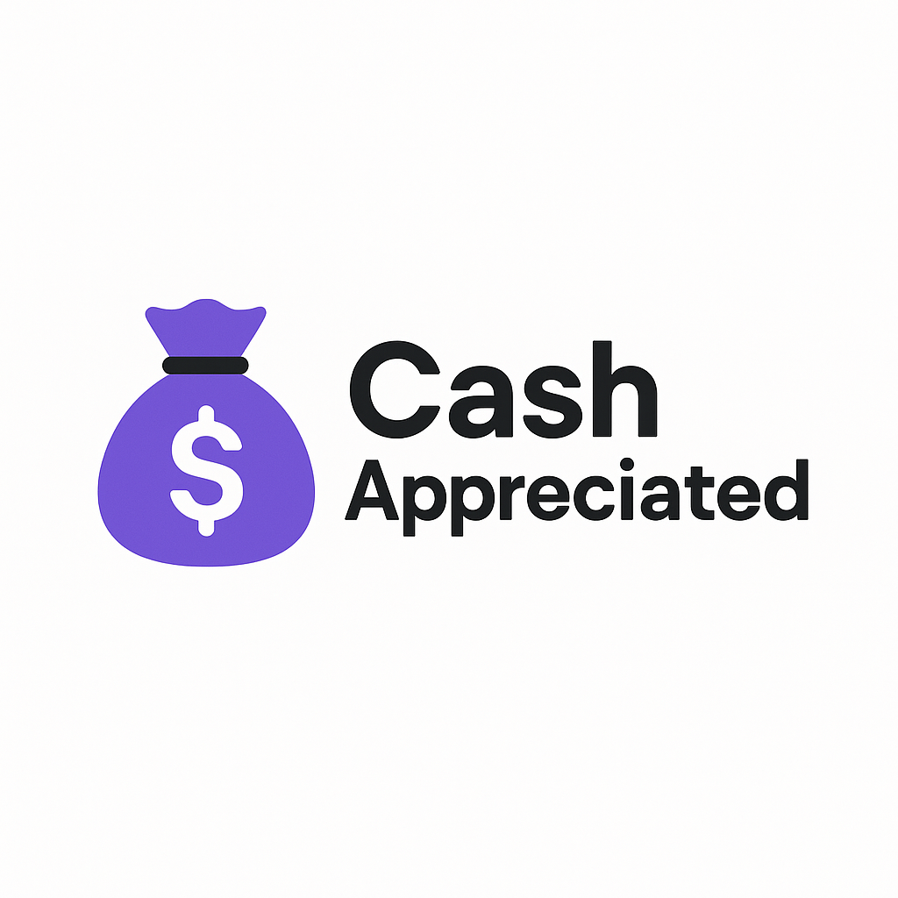
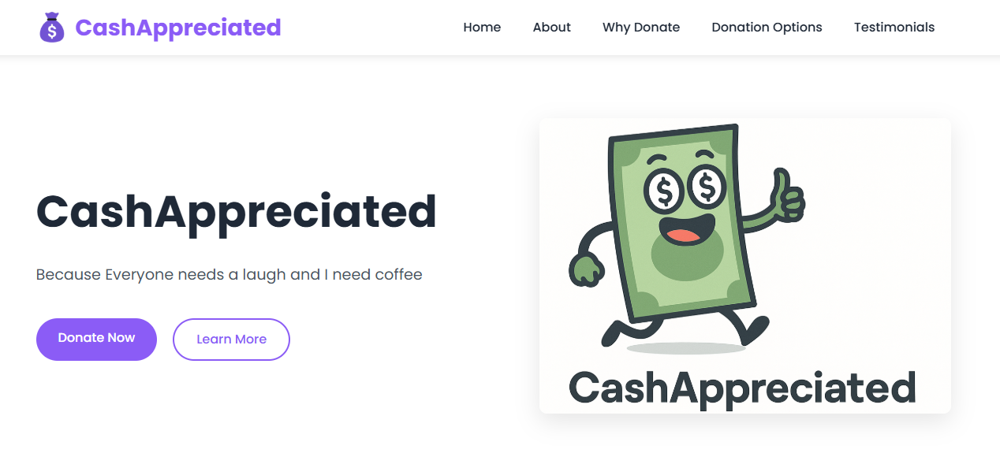
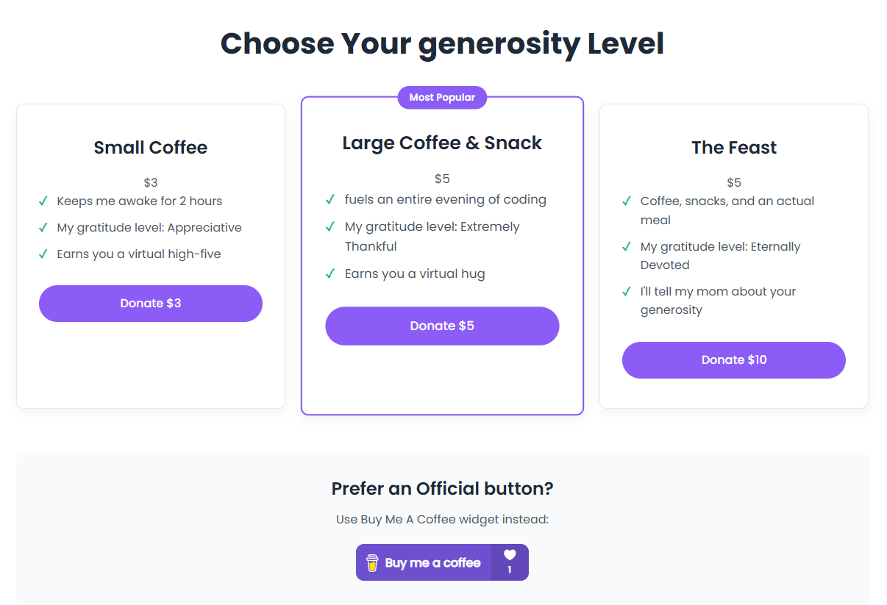
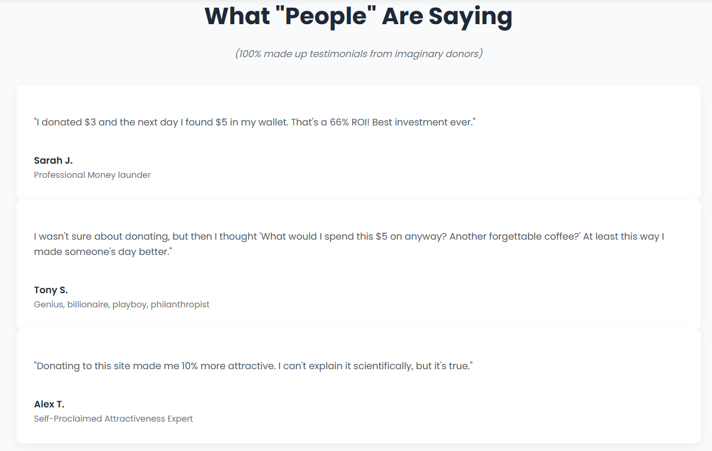

# CashAppreciated - A Humorous Donation Landing Page

## Project Description

CashAppreciated is a lighthearted landing page created for Web Development Lab 2. This joke donation site combines humor with actual donation functionality through the "Buy Me A Coffee" widget.

The concept is simple and honest: no grand causes, no sob stories - just a student who needs coffee to fuel late-night coding sessions. The site uses humor to encourage small donations while providing a fun user experience.

## Preview

## Live Demo

Visit the site here: [https://lab2.cashappreciated.com/](https://lab2.cashappreciated.com/)

## Features

- **Clean, Modern Design**: A visually appealing layout with a cohesive color scheme
- **Intuitive Navigation**: Easy-to-use menu for accessing different sections
- **Clear Call-to-Action**: Prominent donation buttons throughout the page
- **Multiple Donation Options**: Various humorous donation tiers
- **Buy Me A Coffee Integration**: Real donation functionality
- **Responsive Layout**: Optimized for all screen sizes
- **Engaging Content**: Humor-driven copy that entertains while encouraging donations

## Sections

1. **Hero Section**: Eye-catching introduction with primary call-to-action
2. **About Section**: Explains the joke concept behind the site with honesty and humor
3. **Why Donate Section**: Presents funny "reasons" to donate
4. **Donation Options Section**: Different donation tiers with humorous descriptions
5. **Testimonials Section**: Fictional testimonials from "previous donors"
6. **Footer**: Contact info and quick links

## Technologies Used

- HTML5
- CSS3
- Font Awesome for icons
- Buy Me A Coffee widget for donation functionality

## Development Process

This project was created as part of the Web Development Lab 2 assignment. The development process included:

1. Planning the site structure and sections
2. Creating basic HTML structure
3. Adding CSS styling with a focus on visual appeal
4. Implementing responsive design
5. Integrating the Buy Me A Coffee widget
6. Testing and deployment

## Screenshot Gallery

<em>The hero section welcomes visitors with a clear message</em>

<em>Humorous donation options make giving fun</em>

<em>"Real" testimonials add to the site's humorous tone</em>

## How to Run Locally

1. Clone this repository
2. Open `index.html` in your browser

## Future Improvements

- Add dark mode toggle
- Implement more interactive elements
- Add a donation counter
- Create personalized thank you messages

---

Created by Negai Marin for Web Development Lab 2 | Technical University of Moldova